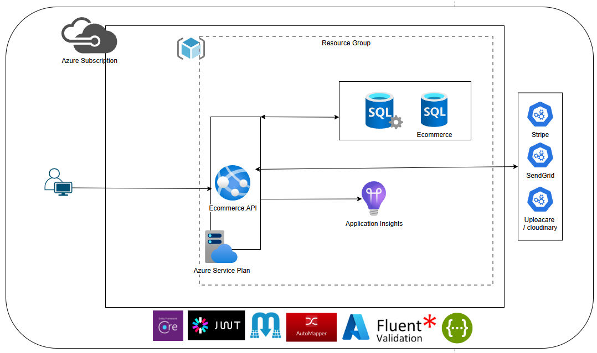

# Ecommerce – Backend ASP.NET Core 8 con Clean Architecture

> API REST para un sistema de **Ecommerce** construida con **ASP.NET Core 8 **, siguiendo **Clean Architecture**, principios **SOLID** y buenas prácticas profesionales.  
> Incluye autenticación con **JWT**, múltiples roles, **CQRS + MediatR**, **Specification Pattern**, **Entity Framework Core**, **Stripe** como pasarela de pagos, **SendGrid** para envío de correos y validaciones con **FluentValidation**.

---

## 📌 Descripción general

Este repositorio contiene el **backend (API REST)** de un sistema de Ecommerce moderno, diseñado para ser:

- **Escalable**: arquitectura limpia, desacoplada y preparada para crecer.
- **Mantenible**: principios de **Clean Code** y **SOLID**.
- **Extensible**: capas bien definidas, patrones claros (CQRS, Specification, Middleware).
- **Seguro**: autenticación y autorización basada en **JSON Web Tokens (JWT)** con múltiples roles.

La API expone endpoints que serán consumidos por un **frontend en React** (con Redux y Slices Store), pero puede integrarse con cualquier cliente (SPA, Mobile, etc.).

---

## 🎯 Objetivos principales

- Implementar **Clean Architecture** de forma profesional.
- Organizar el proyecto en capas: **Domain**, **Application**, **Persistence**, **Api**.
- Implementar **paginación avanzada** y filtros con **Specification Pattern** + EF Core.
- Utilizar **CQRS + MediatR** para separar claramente **Commands** y **Queries**.
- Implementar un modelo de **seguridad con múltiples roles** usando **JWT**.
- Integrar servicios externos:
  - **SendGrid** para envío de correos.
  - **Stripe** como pasarela de pagos.
  - **Servicio de almacenamiento en la nube** para subida de imágenes.
- Aplicar **FluentValidation** para validar transacciones y entradas de usuario.
- Implementar **recuperación de contraseña** vía correo electrónico.
---

## Diagrama de infraestructura


---
---

## 🧱 Arquitectura del proyecto

El backend sigue un enfoque clásico de **Clean Architecture Architecture**, con dependencias dirigidas hacia el dominio:

```text
Presentation (Api)
        ↓
   Application
        ↓
   Persistence
        ↓
     Domain
```

### 🧩 Capas

#### 🟣 Domain
- Entidades de negocio.
- Value Objects, enumeraciones, reglas de dominio.
- Sin dependencias hacia otras capas.

#### 🔵 Application
- Casos de uso de la aplicación.
- Implementación de **CQRS** (Commands & Queries).
- Handlers de **MediatR**.
- Interfaces de repositorios.
- DTOs y ViewModels.
- Validaciones con **FluentValidation**.

#### 🟢 Persistence
- Implementación de repositorios con **Entity Framework Core**.
- Configuración y mapeos de entidades (Fluent API).
- **Migrations**.
- Carga automática de **Master Data** en SQL Server (seeding).

#### 🟠 Api
- Endpoints **REST** con **ASP.NET Core**.
- Controllers que delegan la lógica a la capa Application (no contienen lógica de negocio).
- Configuración de:
  - **JWT Authentication**
  - **Authorization (Roles)**
  - **Swagger**
  - **CORS**
  - **Middlewares globales** (manejo de excepciones, manejo de errores).

---

## 🛡️ Seguridad

- Autenticación basada en **JSON Web Tokens (JWT)**.
- Múltiples **roles** (por ejemplo: `Admin`, `Customer`, etc.).
- Protección de endpoints con atributos `[Authorize]` y políticas.
- Refresh y expiración de tokens configurables (según implementación).
- Endpoints para:
  - Registro de usuarios.
  - Login.
  - Recuperación de contraseña mediante correo electrónico.

---

## ✉️ Correos y recuperación de contraseña

Integración con **SendGrid** para:

- Envío de correos transaccionales (por ejemplo, confirmación de registro).
- Envío de correo de **recuperación de contraseña**:
  - Generación de token seguro.
  - Enlace de reseteo de contraseña enviado al correo del usuario.

---

## 💳 Pagos con Stripe

La API se integra con **Stripe** como **pasarela de pagos**:

- Creación de **intents de pago** o cargos (según diseño).
- Validación segura de transacciones.
- Manejo de respuestas y errores de Stripe.
- Posibilidad de extender a webhooks (según evolución del proyecto).

---

## 🖼️ Subida de imágenes

- Subida de imágenes (por ejemplo, fotos de productos) usando un **servicio de almacenamiento en la nube**.
- El backend expone endpoints para subir archivos y guardar las URLs en base de datos.
- El proveedor de almacenamiento es **configurable** mediante `appsettings.json` (Azure Blob / Cloudinary / uploadcare).

---

## 🔍 Paginación y Specification Pattern

Se utiliza el **Specification Pattern** junto con **Entity Framework Core** para:

- Paginación avanzada (page size, page index).
- Filtros dinámicos (por ejemplo, categoría, rango de precios, estado, etc.).
- Ordenamiento configurable.
- Reutilización de lógica de filtros en múltiples consultas.

Esto permite consultas limpias y expresivas sin saturar los repositorios ni los controladores.

---

## 🧠 CQRS + MediatR

La lógica de negocio se divide en:

- **Commands** – Operaciones de escritura (crear, actualizar, eliminar).
- **Queries** – Operaciones de lectura (consultar listados, detalles, etc.).

La capa Application utiliza **MediatR** para:

- Enviar Commands/Queries a sus respectivos Handlers.
- Desacoplar controladores de la lógica interna.
- Facilitar pruebas unitarias.

Ejemplo conceptual:

```csharp
// Controller
public async Task<IActionResult> Create([FromBody] CreateProductCommand command)
{
    var result = await _mediator.Send(command);
    return Ok(result);
}
```

---

## ✅ Validaciones con FluentValidation

- Cada Command/Query importante tiene su **Validator** correspondiente.
- Se valida:
  - Reglas de negocio básicas (campos obligatorios, rangos, formatos).
  - Restricciones de dominio.
- Integración con el pipeline de MediatR para lanzar excepciones o devolver errores amistosos al cliente.

---

## 🧪 Clean Code y SOLID

Se aplican principios de:

- **Single Responsibility**: cada clase tiene un motivo claro.
- **Open/Closed**: fácil de extender sin modificar código existente.
- **Dependency Inversion**: capas superiores dependen de abstracciones, no de implementaciones concretas.
- **Separation of Concerns**: dominio, aplicación, infraestructura y presentación claramente separados.
- Estándares de nombres, organización de carpetas y convenciones consistentes.

---

## 🧰 Tecnologías principales

- **Backend**
  - ASP.NET Core Web API Version 8
  - Entity Framework Core
  - MediatR
  - FluentValidation
  - AutoMapper (si aplica, para mapping entre entidades y DTOs)
- **Seguridad**
  - JSON Web Tokens (JWT)
  - Autorización basada en roles
- **Base de datos**
  - SQL Server
  - EF Core Migrations & Seeding
- **Integraciones**
  - SendGrid (envío de correos)
  - Stripe (pagos)
  - Servicio de almacenamiento en la nube para imágenes
---

## 🚀 Puesta en marcha

### 1. Prerrequisitos

- SDK de **.NET** instalado.
- **SQL Server** en local o remoto.
- Cuenta y claves de:
  - **SendGrid**
  - **Stripe**
  - Proveedor de almacenamiento de imágenes (si aplica).

### 2. Clonar el repositorio

```bash
git clone https://github.com/<tu-usuario>/<tu-repo>.git
cd <tu-repo>
```

### 3. Configuración de `appsettings.json`

En el proyecto **Ecommerce.Api**, configurar:

- ConnectionStrings
- JWT
- SendGrid
- Stripe
- CloudStorage (según proveedor)

Ejemplo ilustrativo:

```json
{
  "ConnectionStrings": {
    "DefaultConnection": "Server=.;Database=EcommerceDb;Trusted_Connection=True;TrustServerCertificate=True;"
  },
  "Jwt": {
    "Key": "TU_LLAVE_SECRETA_SUPER_SEGURA",
    "Issuer": "EcommerceApi",
    "Audience": "EcommerceClient",
    "ExpiresInMinutes": 60
  },
  "SendGrid": {
    "ApiKey": "TU_API_KEY_SENDGRID",
    "FromEmail": "no-reply@tudominio.com",
    "FromName": "Ecommerce"
  },
  "Stripe": {
    "SecretKey": "TU_STRIPE_SECRET_KEY",
    "PublishableKey": "TU_STRIPE_PUBLISHABLE_KEY"
  },
  "CloudStorage": {
    "Provider": "TuProveedor",
    "ConnectionString": "cadena-de-conexion-o-configuracion"
  }
}
```

> **Nota:** No subas estos valores reales a GitHub. Usa variables de entorno o `User Secrets` en desarrollo.

### 4. Aplicar migraciones de base de datos

Desde el proyecto de Persistence (o donde residan las migraciones):

```bash
dotnet ef database update
```

Esto creará la base de datos y cargará la **data maestra** inicial.

### 5. Ejecutar la API

```bash
dotnet run --project src/Ecommerce.Api
```

La API normalmente quedará disponible en:

```text
https://localhost:<puerto>/
```

Puedes revisar la documentación de endpoints en:

```text
https://localhost:<puerto>/swagger
```

---

## 🧭 Roadmap / Mejoras

- Implementar **tests automatizados** más completos (unitarios, integrales, de contrato).
- Agregar **logging estructurado** (Serilog, Seq, ELK, etc.).
- Implementar **cacheo** para catálogos de lectura intensiva.
- Exponer métricas con **Health Checks** y/o **Prometheus**.
- Internacionalización (i18n) de mensajes.
---

## 🙋 Sobre el proyecto

Este backend fue construido como parte de un proyecto de aprendizaje y portafolio para demostrar:

- Dominio de **ASP.NET Core** en entornos profesionales.
- Aplicación real de **Clean Architecture, SOLID, CQRS, Specification**.
- Integración con servicios externos (pagos, correos, almacenamiento).
- Buenas prácticas de diseño y organización de soluciones empresariales.

---

## 📄 Licencia

```text
MIT License – Proyecto como referencia de base para propias implementaciones.
```
